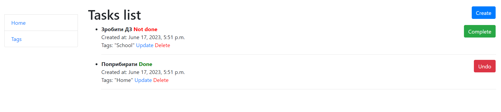
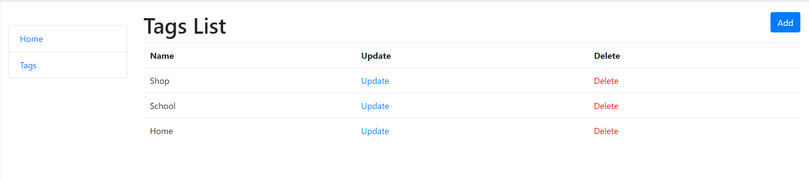
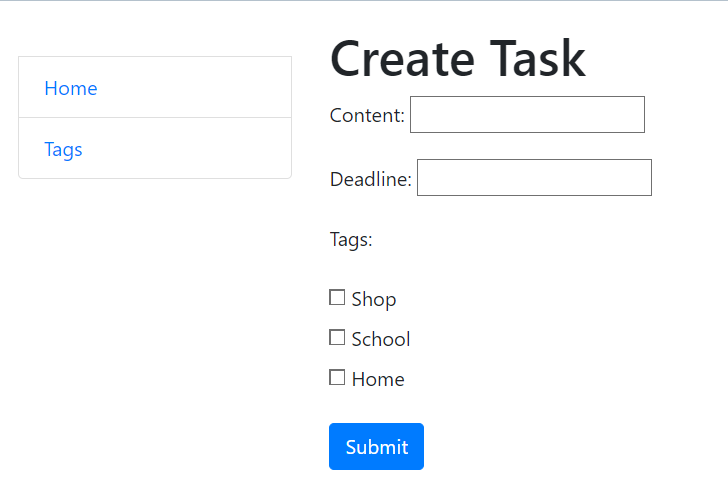

# Todo List
This is a practice project that implements a todo list site. The project allows users to manage tasks by creating, updating, and deleting them. It also provides features like setting deadlines, marking tasks as complete, and associating tags with tasks.

## Task
A task represents an item in the todo list. It contains the following fields:

1. content: A description of the task.
2. datetime: The date and time when the task was created.
3. deadline (optional): The date and time by which the task should be completed.
4. is_done: A boolean field indicating whether the task is done or not.
5. tags: Tags relevant to the task.

## Tag
A tag symbolizes the theme of a task. It consists of a name and can be associated with multiple tasks.

## Home Page
The home page can be accessed at 127.0.0.1:8000/. It contains the following elements:

* Sidebar with links to:
1. Home page
2. Tag list page (the sidebar should be displayed on all pages)
* Todo list:
1. A list of tasks ordered from not done to done and from newest to oldest.
2. Each task displays all relevant information.
3. Buttons to update and delete each task.
4. A button to mark a task as complete or undo if it's already done. Clicking this button toggles the status of the task and redirects back to this page.
* A button to add a new task.

## Screenshots

